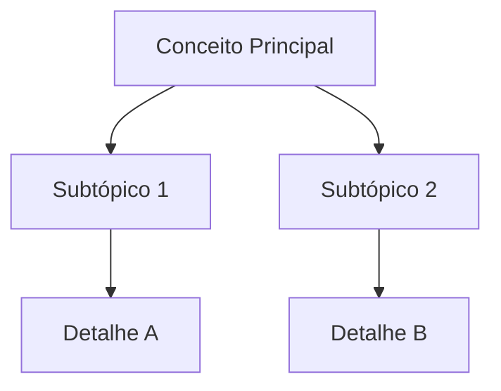

# Obsidian Note Creator

Converts text into a well-formatted Obsidian note, with smart vault navigation, cross-referencing, and back-reference updates.

---

## Step 1 — Vault Setup

### Check for Known Vault

Look for `~/.claude/obsidian-config.json`. If it exists and has a `default: true` vault, use it. If not, ask:

```
What is your Obsidian vault path? (e.g., C:\Users\Nathan\Documents\MyVault)
```

Once confirmed, save to `~/.claude/obsidian-config.json`:

```json
{
  "vaults": [
    {
      "name": "MyVault",
      "path": "C:/Users/Nathan/Documents/MyVault",
      "default": true
    }
  ]
}
```

### CLI / Opening Notes in Obsidian

After writing, the skill will attempt to open the note using the `obsidian://` URI scheme. No extra install needed if Obsidian is installed.

**Windows:** `start "obsidian://open?vault={{vault-name}}&file={{encoded-path}}"`
**macOS:** `open "obsidian://open?vault={{vault-name}}&file={{encoded-path}}"`

If this fails, inform the user and suggest the **Obsidian Local REST API** plugin as an alternative:
1. Obsidian → Settings → Community Plugins → Browse → "Local REST API" → Install & Enable
2. API runs at `http://localhost:27123/vault/` — requires API key shown in plugin settings

Direct vault file writing always works regardless of CLI availability.

---

## Step 2 — Content Mode

Ask the user how to handle the input:

```
How would you like the content formatted?

1. Exact     — Keep the text as-is, just format it for Obsidian
2. Improve   — Fix structure, clarity, and flow while preserving all content
3. Simplify  — Remove redundancy, rewrite for clarity, keep core ideas
4. Summarize — Extract key points into a concise note (optional collapsible detail sections)

Enter 1–4:
```

---

## Step 3 — Smart Folder Detection

Use the topic hint (or infer from content) to find the right place in the vault.

### Detection Algorithm

```
Input: topic = "MBA - Introdução ao tema X"

1. Parse: parent="MBA", subtopic="Introdução ao tema X"
2. Search vault for parent folder match:
   - Found: vault/MBA/
3. Search for existing subtopic match under MBA:
   - vault/MBA/introducao-tema-x/  → not found
4. Present options to user (see table below)
```

### Decision Table

| Scenario | What to present |
|----------|----------------|
| Parent exists, subtopic folder exists | Suggest placing note inside it, confirm |
| Parent exists, subtopic is new | Suggest `MBA/introducao-tema-x/introducao.md` (subfolder) or `MBA/introducao-tema-x.md` (flat), confirm |
| Parent does not exist | Ask: "Is *MBA* a new top-level subject? Shall I create `vault/MBA/`?" |
| No topic hint | Infer 2–3 candidate folders from content, present to user |
| User provides explicit path | Confirm and use it |

**Always confirm the final path with the user before writing.** Present the suggestion clearly:

```
Suggested location: vault/MBA/introducao-tema-x/introducao.md

Options:
  a) Use this path
  b) vault/MBA/introducao-tema-x.md  (flat file)
  c) Enter a custom path

Choose a/b/c:
```

---

## Step 4 — Scan for Existing Notes

Before generating content, scan the destination folder:

```bash
# List .md files near the destination
ls "vault/MBA/"*.md "vault/MBA/"**/*.md 2>/dev/null
```

Read the frontmatter and first heading of each file. Classify:

| Classification | Action |
|----------------|--------|
| **Same topic** (very similar title/content) | Warn user: "A similar note exists at `path`. Merge or create new?" |
| **Related topic** | Collect as cross-references to add to new note's `## Referências` — **only if the file physically exists in the vault** |
| **Index / MOC file** | Flag for back-reference update in Step 7 |

**Cross-reference rule:** Only add `[[wikilinks]]` to notes that were found on disk during this scan. Never generate links to files that do not exist — Obsidian will display them as broken (red) links and pollute the graph view.

---

## Step 5 — Generate Markdown

### Note Template

```markdown
---
tags: [tag1, tag2]
date: {{YYYY-MM-DD}}
source: "{{optional source}}"
related:
  - "[[related-note-1]]"
  - "[[related-note-2]]"
---

# {{Title}}

> {{One-line key insight or summary — optional}}

## {{Section 1}}

Content...

## {{Section 2}}

Content...

## Referências

- [[related-note-1]]
- [[related-note-2]]
```

### Formatting Rules

- Use `[[wikilinks]]` for internal references — **never** markdown `[text](path)` for internal links
- Tags go in frontmatter `tags: []` — not inline `#tag`
- H1 for title only, H2 for major sections, H3 for subsections
- `> blockquote` for key definitions or critical quotes
- `**bold**` sparingly — only for core terms first introduced
- Always include `## Referências` at the bottom with links to related notes found in Step 4

### Mermaid Diagrams

Add a mermaid diagram when content has process, hierarchy, or timeline structure:

| Content type | Diagram |
|-------------|---------|
| Processes, workflows | `flowchart TD` |
| Topic hierarchy / mind map | `mindmap` |
| Relationships, OOP | `classDiagram` |
| Timelines, phases | `timeline` or `gantt` |
| Comparisons | Use a markdown table instead |

Example:

````markdown

````

**Mermaid line-break rule:** Obsidian's mermaid renderer does **not** support `\n` as a line break inside node labels. Use `<br/>` for multi-line labels instead:

```
A["Linha 1<br/>Linha 2"] --> B[Nó B]
```

Never use `\n` inside node labels — it renders literally as the characters `\n`.

---

## Step 6 — Write and Open

1. Create the directory if needed
2. Write the note using the Write tool
3. Attempt to open in Obsidian via URI scheme

```
# Windows
start "obsidian://open?vault=MyVault&file=MBA%2Fintroducao-tema-x%2Fintroducao.md"

# macOS  
open "obsidian://open?vault=MyVault&file=MBA/introducao-tema-x/introducao.md"
```

Inform the user: "Note created at `vault/MBA/introducao-tema-x/introducao.md`."

---

## Step 7 — Update Back-References

After creating the note, identify candidate files to update:

- **Index/MOC files** — `index.md`, `_index.md`, `MOC.md`, or `{{folder-name}}.md` in the parent folder
- **Related notes** — files found in Step 4 that are topically related
- **Parent topic note** — if the new note is a subtopic of an existing note

For each candidate, ask the user before modifying:

```
Should I add a link to [[introducao-tema-x]] in:
  a) vault/MBA/MBA.md          (index) → add to "Subtópicos" section
  b) vault/MBA/mba-overview.md (related) → add to "Ver também" section

Approve each (y/n) or skip all (s):
```

Only write to files the user explicitly approves. When approved, append the wikilink in the appropriate section (or create a `## Ver também` section if none exists).

---

## Quick Reference

| Step | Action |
|------|--------|
| 1. Vault | Confirm vault path; setup CLI if needed |
| 2. Mode | Exact / Improve / Simplify / Summarize |
| 3. Folder | Detect location via topic, **always confirm** |
| 4. Scan | Find duplicates and related notes |
| 5. Generate | Create markdown with frontmatter + mermaid |
| 6. Write | Save file, open in Obsidian via URI |
| 7. Back-refs | Ask to update index/related files |

## Common Mistakes

- **Never write to vault without user confirming the path**
- **Never skip Step 7** — back-references make notes discoverable in the graph view
- **Don't use `[text](path)` for internal links** — always `[[wikilinks]]`
- **Don't merge with an existing note without explicit user approval**
- **Don't auto-update back-reference files** — always ask first
- **Never create `[[wikilinks]]` to files that don't exist** — scan first, link only to files found on disk
- **Never use `\n` in mermaid node labels** — use `<br/>` for line breaks inside labels
